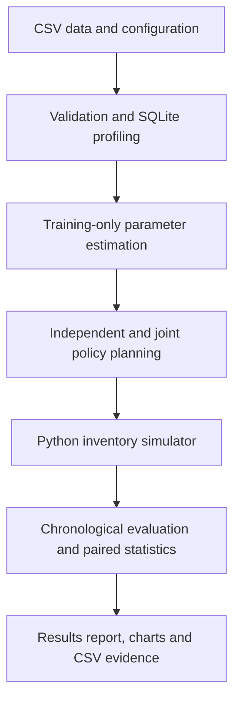

# Inventory Decision Intelligence
### Multi-Echelon Inventory Optimization under Uncertainty

[](https://github.com/buckminster07/multi-echelon-inventory-optimization/actions/workflows/ci.yml)
[](LICENSE)
[](https://colab.research.google.com/github/buckminster07/multi-echelon-inventory-optimization/blob/main/notebooks/01_inventory_decisions.ipynb)

**An end-to-end Python and SQL project answering a practical operations question:**
How should warehouses and stores set inventory targets when demand changes and
supplier lead times are uncertain?

**900 days · 3 SKUs · 2 warehouses · 4 stores · 3 policies · 4 scenarios**

[Business questions](docs/PROBLEM_STATEMENTS.md) · [Measured results](examples/full/RESULTS.md) ·
[Model details](docs/METHODOLOGY.md) · [Validation](docs/VALIDATION.md)


> **Data provenance:** the shipped experiment uses explicitly synthetic records.
> Figures are computed by the pipeline, not inserted as target achievements.
> These are simulation findings, not company savings or deployment results.

## Results worth examining

On the untouched chronological test window:

- **Normal-cost optimization:** reduced normal-scenario cost **22.0%**, but lowered
  aggregate immediate fill from **99.64% to 94.14%**.
- **Service-aware planning:** under combined demand and supplier stress, reduced
  cost **31.6%** versus independent planning and improved aggregate fill from
  **69.90% to 81.27%**. The paired 95% savings interval was **482.82–520.89 cost units/day**.
- **Remaining exposure:** the service-aware policy met the **95% worst store–SKU
  fill target in 2 of 4 test scenarios**. It also held more stock and cost more
  under normal conditions. Better stress performance is not a universal win.

| Test scenario | Independent cost/day | Normal-optimized cost/day | Service-aware cost/day | Independent fill | Service-aware fill |
|---|---:|---:|---:|---:|---:|
| Normal | 430.46 | 335.70 | 612.09 | 99.64% | 99.93% |
| Demand spike | 484.60 | 837.07 | 584.27 | 95.39% | 98.79% |
| Supplier delay | 338.09 | 2,041.83 | 466.62 | 97.42% | 99.79% |
| Combined stress | 1,590.15 | 4,411.40 | 1,088.29 | 69.90% | 81.27% |

Costs are illustrative cost units. Aggregate fill can hide weak store–SKU pairs;
see [the full results](examples/full/RESULTS.md) for worst-pair service and
[raw trial evidence](examples/full/trials.csv). The experiment supports choosing
policies according to a cost/service trade-off rather than a headline saving.

## Business questions → implemented answers

| Problem | Implementation | Inspectable output |
|---|---|---|
| How variable is demand, and how long does replenishment take? | Validated CSV ingestion, relational SQLite tables, SQL joins and training-only statistics | Demand and lead-time profiles |
| Where should safety inventory be placed? | Analytical independent baseline; joint warehouse/store target search | Stock targets and every candidate score |
| How do we account for service commitments? | Select a low-cost candidate subject to a training service threshold across stores and scenarios | Feasibility flags and worst-pair fill |
| What happens during demand spikes or supplier delays? | From-scratch simulator with per-order random transport times, FIFO dispatch and customer backorders | Trial metrics and daily inventory/backlog traces |
| Do decisions generalize beyond fitted data? | Chronological train/validation/test windows, held-out seeds and an excluded combined-stress search scenario | Paired confidence intervals and validation/test tables |

## Run the complete project

Python 3.10+; CPU only. No paid API, external database server or private data is needed.

```bash
git clone https://github.com/buckminster07/multi-echelon-inventory-optimization.git
cd multi-echelon-inventory-optimization
python -m venv .venv
```

Activate with `source .venv/bin/activate` on macOS/Linux, or
`.venv\Scripts\Activate.ps1` in Windows PowerShell. Then:

```bash
python -m pip install -e ".[dev]"
python -m pytest -q
python -m inventory_lab.cli --config configs/demo.json --output outputs/full
```

Open **`outputs/full/report.html`** in your browser to view the results report.
It is a local report with linked CSV evidence, not a hosted production dashboard.
The run also creates `RESULTS.md`, two figures, stock targets, SQL profiles,
trial CSVs, a SQLite database and a provenance manifest. Runtime depends on hardware.

For the existing run, download the repository and open
[`examples/full/report.html`](examples/full/report.html) locally. GitHub displays
HTML source rather than rendering the report. The README figures render directly.

## Pipeline architecture



The network is configured by `nodes.csv`; each store references one warehouse.
The demo supplies six locations. Additional warehouses, stores and SKUs can be
provided through the same schema; SKU simulations have no shared capacity constraints.

## What was implemented from scratch?

The Python code in this repository implements shipment events, inventory-position
ordering, warehouse allocation, backorders, stochastic lead-time sampling,
material-balance checks, finite-grid policy search and experiment orchestration.
**Version 0.2 does not call Stockpyl.** NumPy/Pandas/SciPy/Matplotlib provide general
numerical, data and reporting functions. The earlier Stockpyl prototype remains
available in Git history, with attribution in [ACKNOWLEDGMENTS.md](ACKNOWLEDGMENTS.md).

## Reproducible evaluation

- **Training:** first 540 days; demand moments and received shipment lead times only.
- **Validation:** next 180 days, diagnostic reporting with frozen policies.
- **Test:** final 180 days, with no parameter selection or retuning.
- **Search:** 36 warehouse/store multiplier pairs per SKU; 108 candidates total.
- **Training uncertainty:** two bootstrap paths per search scenario; normal demand,
  demand spike and supplier delay. Combined stress is excluded from search.
- **Evaluation:** 12 lead-time seeds × 4 scenarios × 3 policies × 3 SKUs × 2 windows
  = **864 SKU simulation runs**, plus **648 candidate evaluation runs**.
- **Accounting:** physical inventory, demand and open store orders reconcile every day.
- **Provenance:** input SHA-256 hashes, full configuration, selected policies and
  dependency versions are saved in [`manifest.json`](examples/full/manifest.json).

The service threshold is enforced on estimated training performance, not guaranteed
on future demand. Confidence intervals capture lead-time randomness conditional
on the demand history. They do not cover all model uncertainty.

## Code map

| File | Responsibility |
|---|---|
| `src/inventory_lab/data.py` | Data generation, contract validation, SQLite preparation and date splits |
| `src/inventory_lab/sql/` | Relational schema, joined demand profiles and observed lead times |
| `src/inventory_lab/simulator.py` | From-scratch daily inventory engine and accounting checks |
| `src/inventory_lab/planning.py` | Baseline targets, scenario construction, candidate search and feasibility |
| `src/inventory_lab/evaluation.py` | Chronological evaluation, demand-weighted fill and paired intervals |
| `src/inventory_lab/report.py` | Figures, Markdown results and portable HTML report |
| `src/inventory_lab/cli.py` | Complete reproducible pipeline |
| `configs/demo.json` | Costs through input tables, horizons, seeds, service target and search settings |
| `notebooks/01_inventory_decisions.ipynb` | Colab/local walkthrough invoking the tested Python modules |
| `tests/` | Deterministic examples, data leakage guards and end-to-end tests |
| `examples/full/` | Executed experiment inputs and outputs |

## Use compatible business data

```bash
python -m inventory_lab.cli --data-dir /path/to/csvs --output outputs/custom
```

Supply `nodes.csv`, `skus.csv`, `demand.csv` and `receipts.csv` following the
[data contract](docs/DATA.md). Use actual requested demand rather than stockout-censored
sales. Lead-time records describe dispatch-to-receipt transport time; they must
not silently include inventory waiting time.

## Scope and next decisions

Implemented: multi-SKU two-echelon planning, random per-order transport times,
backorders, stress testing and reproducible reports. Not implemented: shared SKU
capacity, purchase order costs, expiration, forecasting ML, approval workflows,
ERP integration or a production planning interface.

The selected policy is best among tested grouped multipliers, not a globally
optimal inventory configuration. Stores within a SKU share a target multiplier,
although their actual targets differ. These choices keep the search transparent.
See the [methodology](docs/METHODOLOGY.md) and [decision brief](docs/DECISION_BRIEF.md).

## License and contribution

[MIT](LICENSE). [Contribution guide](CONTRIBUTING.md).
Implementation was developed with AI assistance; ownership, testing and modeling
assumptions are documented in [ACKNOWLEDGMENTS.md](ACKNOWLEDGMENTS.md).
