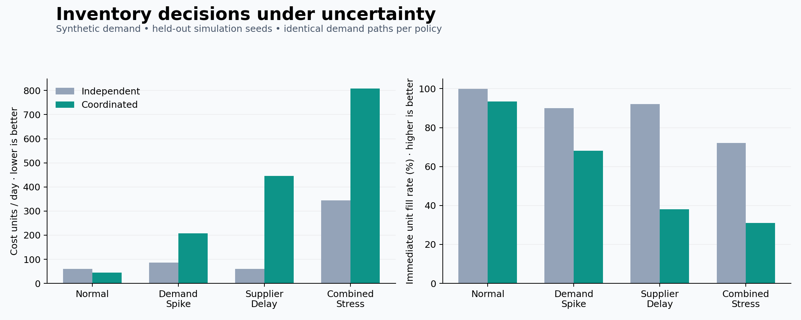
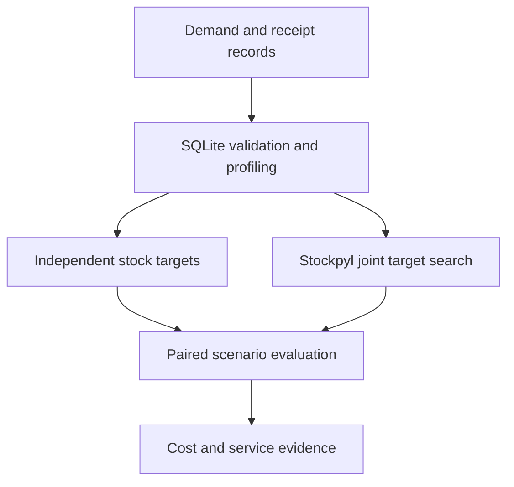

# Multi-Echelon Inventory Optimization under Uncertainty

**SQL analysis → inventory decisions → paired scenario validation**

A reproducible inventory decision project that asks: **how much stock should a
warehouse and its stores hold, and what happens when demand or supply changes?**

The application turns demand and replenishment records into inventory parameters,
uses **Stockpyl** to jointly search stock targets, and benchmarks them against an
independent planning heuristic. Results include cost, immediate fill rate,
shortages and confidence intervals—not just an optimization score.

**Python · SQLite · Stockpyl · NumPy/Pandas · SciPy · Matplotlib · pytest**

> **Evidence scope:** runnable portfolio implementation with synthetic data.
> The example below was produced by the code. It is not a deployment or a claim
> of savings achieved at an employer.



## What the experiment found

In the default experiment, normal-demand optimization lowered mean daily cost
from **60.35 to 44.44 cost units (26.4%)** on fresh simulation seeds. Immediate
fill rate fell from **99.95% to 93.44%**. Under a persistent supplier delay, those
same stock targets performed substantially worse than the independent baseline.

| Scenario | Independent cost/day | Coordinated cost/day | Independent fill | Coordinated fill |
|---|---:|---:|---:|---:|
| Normal | 60.35 | 44.44 | 99.95% | 93.44% |
| Demand spike | 86.03 | 207.73 | 90.00% | 68.18% |
| Supplier delay | 60.80 | 445.05 | 92.12% | 38.07% |
| Combined stress | 344.26 | 807.60 | 72.07% | 31.06% |

**Decision implication:** a cost-only policy calibrated to normal demand should
not be rolled out without a service target and disruption testing. The observed
cost saving is a trade-off, not evidence that one policy dominates all scenarios.

[Detailed results and paired 95% intervals](examples/demo/RESULTS.md) ·
[Raw trial-level evidence](examples/demo/trials.csv) ·
[Configuration, versions and input hashes](examples/demo/manifest.json)

## Run it

Python 3.10+ is supported by the package; the included full run was validated
on Python 3.12. A CPU is sufficient. No paid API, account, database server or
private dataset is required.

From the repository root:

```bash
python -m venv .venv
```

Activate the environment:

```bash
# macOS / Linux
source .venv/bin/activate

# Windows PowerShell
.venv\Scripts\Activate.ps1
```

Install, test and execute:

```bash
python -m pip install -e ".[dev]"
python -m pytest -q
python -m inventory_lab.cli --config configs/demo.json --output outputs/demo
```

Open `outputs/demo/RESULTS.md` and `outputs/demo/policy_comparison.png`.
The default run searches 27 combinations and evaluates 160 policy/scenario/seed
combinations; runtime varies by machine. To match the recorded direct dependency
versions on Python 3.12, install `requirements-reproduce.txt` before the editable
package. Transitive dependency versions are not fully locked.

**Google Colab:** upload and open
[`notebooks/01_inventory_decisions.ipynb`](notebooks/01_inventory_decisions.ipynb),
then upload the repository ZIP to `/content`. The first cell extracts it and
sets the working directory. The notebook calls the same application code as the CLI.
The Colab interface itself was not exercised during local validation.

## How it works



1. **Data analysis.** Generate reproducible records or import compatible CSVs;
   validate keys and dates; estimate demand moments and lead-time statistics.
2. **Inventory decisions.** Construct a one-warehouse, two-store network. Compare
   independently calculated base-stock levels with jointly searched targets.
3. **Validation.** Freeze the selected policy and run four scenarios on 20 fresh
   seeds. Use identical demand paths for both policies, a warm-up exclusion,
   paired cost intervals and explicit service metrics.

The default input contains **1,080 daily demand records**, covering **540 days**
for **two stores and one SKU**. Replenishment records cover all three nodes.
Cost assumptions and experimental settings are explicit in
[`configs/demo.json`](configs/demo.json).

## Repository guide

| Path | Purpose |
|---|---|
| `src/inventory_lab/data.py` | Synthetic records, validation and SQLite integration |
| `src/inventory_lab/sql/` | Schema, demand statistics and lead-time queries |
| `src/inventory_lab/model.py` | Independent baseline and Stockpyl simulator adapter |
| `src/inventory_lab/experiment.py` | Joint search, held-out seeds and paired intervals |
| `src/inventory_lab/report.py` | Result tables and figure generation |
| `src/inventory_lab/cli.py` | One-command execution and provenance manifest |
| `configs/demo.json` | Costs, seeds, horizons, search grid and stress definitions |
| `examples/demo/` | Committed synthetic inputs and actual example outputs |
| `notebooks/` | Notebook/Colab entry point |
| `tests/` | Accounting, data-quality, statistics and integration checks |
| `.github/workflows/ci.yml` | Automated tests after publishing to GitHub |
| `docs/` | Methodology, data contract, validation and publishing guide |

## Reproducibility and limitations

- **Real algorithm integration:** Stockpyl performs multi-echelon simulation and
  grid enumeration; the project supplies the data and experiment layers.
- **Separate selection and evaluation:** optimization seeds 101–103;
  evaluation seeds 1001–1020. Evaluation outcomes never select stock targets.
- **Inspectable search:** all 27 candidate scores are retained. Two selected
  targets are at lower grid boundaries; optimality is limited to this grid.
- **Honest uncertainty:** demand uses empirical bootstrap sampling. Lead times
  are fixed within a scenario, with a separate persistent-delay stress test.
- **Narrow scope:** one SKU, independent stores, unlimited external supply,
  backorders, no capacity or service constraints. Costs are illustrative.
- **Auditable results:** CSV outputs, input SHA-256 hashes, configuration and
  dependency versions accompany the figure. Results include policy failures.

The 95% intervals describe variability across simulation seeds, conditional on
this model. They do not establish future business performance. See
[modeling details](docs/METHODOLOGY.md) and [validation evidence](docs/VALIDATION.md).

## Use your own data

Follow the [data contract](docs/DATA.md), then run:

```bash
python -m inventory_lab.cli --data-dir /path/to/csvs --output outputs/custom
```

This implementation supports exactly stores 1/2, warehouse 0 and SKU-001.
Extending the topology or SKU set requires a model change, not merely a new CSV.
The loader expects requested demand; stockout-censored sales need correction.

## Next research steps

- Add service-constrained or disruption-aware optimization, then evaluate on a
  separately reserved set of seeds.
- Estimate and model correlated demand, seasonality and per-order lead-time uncertainty.
- Introduce capacity, order minimums and transportation costs when supported by data.

These are future extensions, not implemented features.

## References and attribution

Built on [Stockpyl](https://github.com/LarrySnyder/stockpyl), with methodology
informed by its [MEIO tutorial](https://stockpyl.readthedocs.io/en/latest/tutorial/tutorial_meio.html)
and [simulation documentation](https://stockpyl.readthedocs.io/en/latest/tutorial/tutorial_sim.html).
See [acknowledgments](ACKNOWLEDGMENTS.md) for implementation provenance.

**License:** [MIT](LICENSE). **Publishing:** [GitHub setup guide](docs/GITHUB_SETUP.md).
