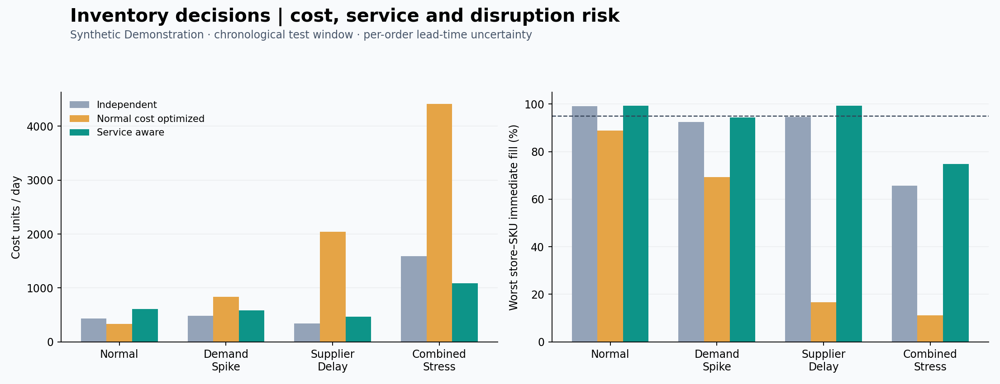
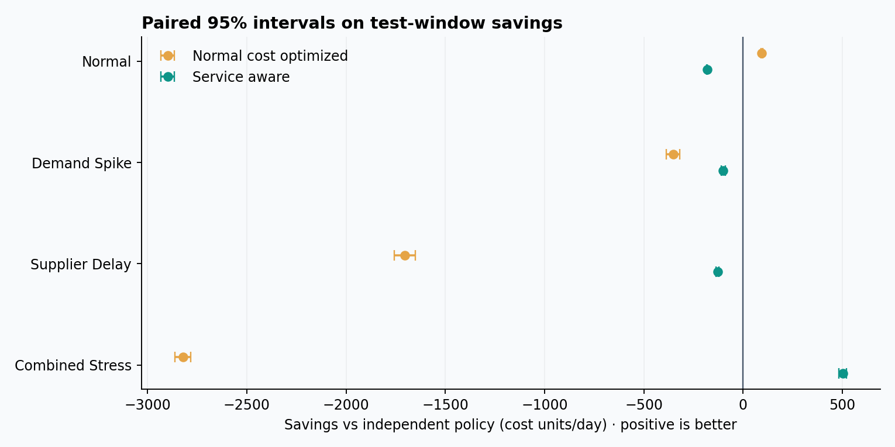

# Measured results

Data: **synthetic demonstration**. No operational deployment is implied.

| Split | Scenario | Policy | Cost/day | Fill | Worst store–SKU fill | Saving vs baseline | 95% CI: saving/day |
|---|---|---|---:|---:|---:|---:|---:|
| validation | normal | independent | 435.54 | 99.78% | 98.03% | 0.0% | [0.00, 0.00] |
| validation | normal | normal_optimized | 323.29 | 95.26% | 91.90% | 25.8% | [107.80, 116.68] |
| validation | normal | service_aware | 621.37 | 99.87% | 98.03% | -42.7% | [-186.54, -185.14] |
| validation | demand_spike | independent | 474.19 | 95.67% | 83.73% | 0.0% | [0.00, 0.00] |
| validation | demand_spike | normal_optimized | 739.86 | 80.35% | 69.70% | -56.0% | [-288.27, -243.06] |
| validation | demand_spike | service_aware | 589.14 | 98.80% | 88.72% | -24.2% | [-120.71, -109.20] |
| validation | supplier_delay | independent | 334.13 | 97.96% | 90.57% | 0.0% | [0.00, 0.00] |
| validation | supplier_delay | normal_optimized | 1705.23 | 45.51% | 27.91% | -410.4% | [-1407.94, -1334.27] |
| validation | supplier_delay | service_aware | 482.09 | 99.79% | 97.74% | -44.3% | [-155.12, -140.80] |
| validation | combined_stress | independent | 1367.32 | 73.13% | 61.66% | 0.0% | [0.00, 0.00] |
| validation | combined_stress | normal_optimized | 3890.64 | 29.67% | 17.09% | -184.5% | [-2562.29, -2484.34] |
| validation | combined_stress | service_aware | 954.01 | 83.35% | 74.31% | 30.2% | [401.17, 425.46] |
| test | normal | independent | 430.46 | 99.64% | 99.02% | 0.0% | [0.00, 0.00] |
| test | normal | normal_optimized | 335.70 | 94.14% | 88.90% | 22.0% | [90.05, 99.46] |
| test | normal | service_aware | 612.09 | 99.93% | 99.28% | -42.2% | [-183.43, -179.83] |
| test | demand_spike | independent | 484.60 | 95.39% | 92.53% | 0.0% | [0.00, 0.00] |
| test | demand_spike | normal_optimized | 837.07 | 77.68% | 69.25% | -72.7% | [-385.57, -319.39] |
| test | demand_spike | service_aware | 584.27 | 98.79% | 94.45% | -20.6% | [-110.83, -88.52] |
| test | supplier_delay | independent | 338.09 | 97.42% | 94.53% | 0.0% | [0.00, 0.00] |
| test | supplier_delay | normal_optimized | 2041.83 | 39.21% | 16.72% | -503.9% | [-1756.78, -1650.70] |
| test | supplier_delay | service_aware | 466.62 | 99.79% | 99.28% | -38.0% | [-135.30, -121.76] |
| test | combined_stress | independent | 1590.15 | 69.90% | 65.68% | 0.0% | [0.00, 0.00] |
| test | combined_stress | normal_optimized | 4411.40 | 25.89% | 11.10% | -177.4% | [-2861.50, -2781.00] |
| test | combined_stress | service_aware | 1088.29 | 81.27% | 74.77% | 31.6% | [482.82, 520.89] |

Intervals are paired over lead-time seeds, conditional on the fixed demand history.
The 95% service target is a training selection constraint; held-out attainment is measured, not guaranteed.

